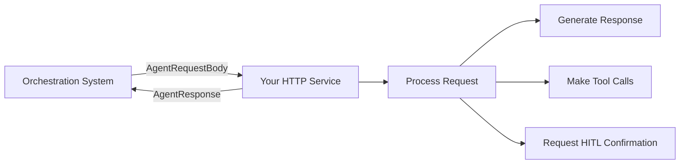

# ADK HTTP Service Contracts

This folder contains the TypeScript schemas that define the HTTP contracts between the orchestration system and external HTTP services (both agents and tools).

## Overview

All HTTP services (LLM agents, tools, etc.) must implement these contracts to integrate with the ADK orchestration system:

- **`AgentRequestBody`** - The request format sent TO your HTTP service
- **`AgentResponse`** - The response format your HTTP service must return
- **Supporting schemas** for function calls, HITL requests, etc.

## Integration Pattern



## Key Schemas

### `AgentRequestBody`
The standard request format sent to all HTTP services:
```json
{
  "agentId": "my_agent",
  "url": "https://my-service.com/api/agent",
  "method": "POST",
  "headers": {"Authorization": "Bearer token"},
  "body": {"query": "What's the weather?"},
  "orgId": "org_123"
}
```

### `AgentResponse`
The required response format from all HTTP services:
```json
{
  "content": "The weather is sunny!",
  "toolCalls": [...],
  "escalate": false,
  "exitFlow": false,
  "waitForUserInput": false,
  "hitlRequest": null
}
```

## Usage

Import these schemas in your TypeScript HTTP service:

```typescript
import { AgentRequestBody, AgentResponse } from "@your-org/core";

// Your HTTP handler
app.post("/agent", (req: AgentRequestBody, res) => {
  const response: AgentResponse = {
    content: "Hello world!",
    // ... other fields
  };
  res.json(response);
});
```

## Control Flow Signals

- **`escalate`** - Stop current container (LoopAgent, SequentialAgent) and pass control to parent
- **`exitFlow`** - Terminate the entire workflow completely  
- **`waitForUserInput`** - Pause for general conversational input
- **`hitlRequest`** - Request specific action confirmation from user 